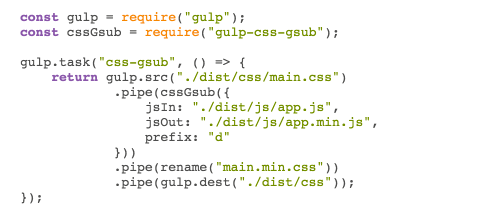

# A gulp module to minify CSS class names.

## Introduction
Gulp-css-gsub is a gulp module that rewrites your js and css files in order to reduce file size and obfuscate your code.

## Installation
    npm install gulp-css-gsub --save-dev

## Usage

## Examples
[Examples](http://milworm.github.io/gulp-css-gsub/demo/index.min.html)

## Authors and Contributors
Created in 2016 by Ruslan Prytula (@milworm).
